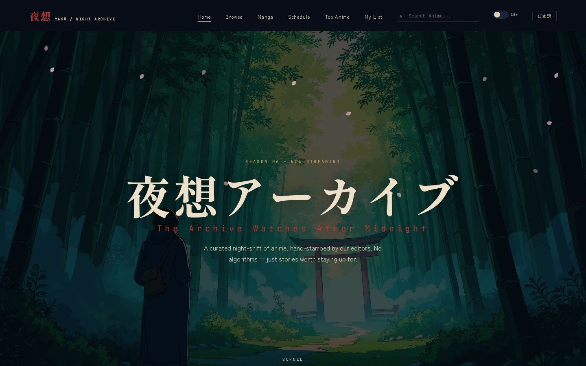

<p align="center">
  
</p>

<h1 align="center">夜想 YASŌ — Night Anime Archive</h1>

<p align="center">
  <a href="https://yaso-anime-backend.onrender.com/">
    
  </a>
  
  
  
  
</p>

<p align="center">
  A curated night-shift anime streaming archive. No algorithms — just stories worth staying up for.<br>
  Built with <b>FastAPI</b> backend + <b>Vanilla JavaScript</b> frontend. Japanese ink-wash aesthetic UI.
</p>

---

## Features

- **Anime Streaming** — Search, browse, watch via Anikoto source
- **Manga Reader** — Read manga chapters via MangaDex API
- **NSFW Toggle** — Isolated NSFW section with 5 dedicated sources (zero cross-contamination with normal content)
- **Continue Watching** — Local storage-based watch history
- **Season Browse** — Browse by season, genre, studio, trending, top
- **Schedule** — Weekly airing schedule
- **Search** — Real-time anime search
- **Dark UI** — Japanese ink-wash / wabi-sabi aesthetic, fully responsive
- **i18n** — Japanese/English toggle
- **Mobile Optimized** — Touch-friendly, PWA-ready

## Tech Stack

| Layer | Technology |
|-------|-----------|
| Backend | Python, FastAPI, Uvicorn |
| Scraping | Requests, BeautifulSoup4 |
| Data | AniList GraphQL API, MangaDex API |
| Frontend | Vanilla HTML/CSS/JS (no framework) |
| Styling | Custom CSS (Japanese/ink-wash aesthetic) |
| Fonts | Shippori Mincho, Zen Kaku Gothic New, JetBrains Mono |

## Data Sources

### Normal Content
| Source | Type | Notes |
|--------|------|-------|
| Anikoto | Anime streaming | Search, stream, homepage |
| AniList | Metadata | GraphQL API for details, browse |
| MangaDex | Manga | Chapter reading |

### NSFW Content (Isolated)
| Source | Type |
|--------|------|
| hanime.tv | Metadata (title-search for streams) |
| ohentai.org | Stream source |
| hentaistream.com | Stream source |
| latesthentai.com | Stream source |
| hentaiyes.com | Stream source |

## Quick Start

```bash
# Clone
git clone https://github.com/rishavbuilder/yaso-anime-backend.git
cd yaso-anime-backend

# Install dependencies
pip install -r requirements.txt

# Run
python anime_scraper.py
# or
uvicorn anime_scraper:app --host 0.0.0.0 --port 8000
```

Open `http://localhost:8000` in your browser.

## API Endpoints

### Normal Anime
| Method | Endpoint | Description |
|--------|----------|-------------|
| GET | `/api/trending` | Trending anime |
| GET | `/api/recent` | Recent episodes |
| GET | `/api/upcoming` | Upcoming anime |
| GET | `/api/search?q=` | Search anime |
| GET | `/api/detail/{id}` | Anime details |
| GET | `/api/stream/{id}/{ep}` | Stream URL |
| GET | `/api/genre/{id}` | Browse by genre |
| GET | `/api/season` | Seasonal anime |
| GET | `/api/schedule` | Weekly schedule |
| GET | `/api/manga/search?q=` | Search manga |
| GET | `/api/manga/{id}` | Manga details |
| GET | `/api/manga/{id}/chapters` | Manga chapters |
| GET | `/api/manga/chapter/{id}` | Read chapter pages |

### NSFW (Isolated)
| Method | Endpoint | Description |
|--------|----------|-------------|
| GET | `/api/nsfw/homepage` | NSFW homepage |
| GET | `/api/nsfw/search?q=` | NSFW search |
| GET | `/api/nsfw/detail/{id}` | NSFW details |
| GET | `/api/nsfw/stream/{id}/{ep}` | NSFW stream URL |

## Project Structure

```
yaso-anime-backend/
├── anime_scraper.py    # FastAPI server (normal anime only)
├── nsfw_routes.py      # NSFW API routes (FastAPI Router)
├── nsfw_scraper.py     # NSFW scrapers (5 sources)
├── data.js             # Frontend API layer
├── site.js             # UI logic & rendering
├── styles.css          # Full CSS (Japanese/ink-wash)
├── index.html          # Homepage
├── watch.html          # Watch page
├── details.html        # Detail page
├── browse.html         # Browse page
├── manga.html          # Manga listing
├── manga-detail.html   # Manga detail
├── reader.html         # Manga reader
├── public/             # Static assets (images, favicons)
├── requirements.txt    # Python dependencies
└── Procfile            # Render deployment
```

## Deployment

Deployed on [Render](https://yaso-anime-backend.onrender.com/) (free tier).

```bash
# Render Start Command
uvicorn anime_scraper:app --host 0.0.0.0 --port $PORT
```

## License

MIT License — see [LICENSE](LICENSE) for details.

---

<p align="center">
  <i>Built with patience and late nights.</i><br>
  <b>夜想 YASŌ</b> — The Archive Watches After Midnight
</p>
